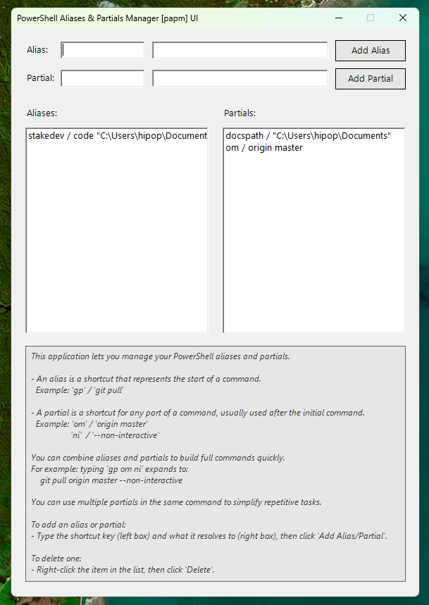
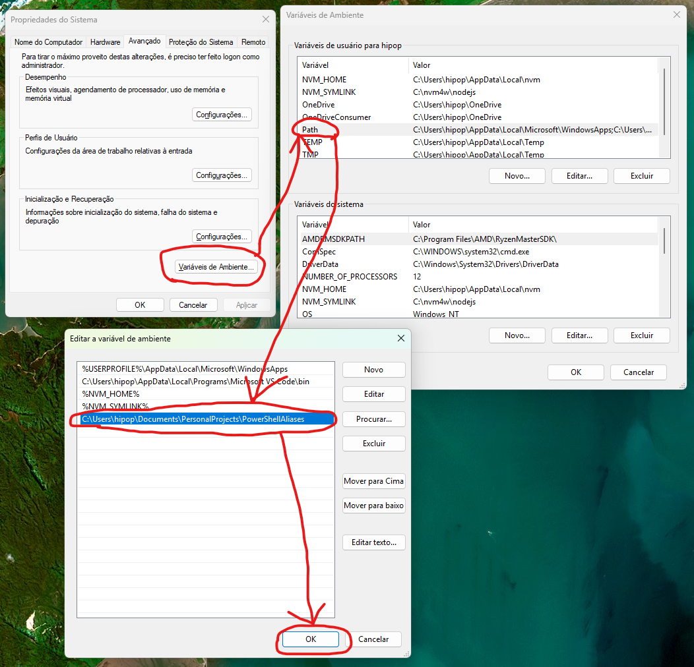

# PAPM - PowerShell Aliases and Partials Manager

**PAPM** is a command-line tool and graphical interface to help you manage custom **aliases** and **partials** in PowerShell, making repetitive or long commands faster and easier to type.

<p align="center">
  
</p>

## ✨ Features

- Define and manage **aliases** (shortcuts for full commands).
- Define and manage **partials** (shortcuts for command parts).
- Combine aliases and partials freely to build complex commands quickly.
- Easy-to-use GUI for managing your configurations (`papm_ui`).
- Simple CLI tool (`papm`) to run expanded commands.

## 📦 Installation

1. **Clone or download** this repository.
2. Ensure you have **PowerShell 5+** or **PowerShell Core (pwsh)** installed.
3. Add the directory containing `papm.ps1` and `papm_ui.ps1` to your system `PATH` environment variable so you can call `papm` and `papm_ui` from anywhere.

   ### Example (on Windows):

   - Copy the folder (e.g. `C:\User\tools\PowerShell-Aliases-Partials-Manager`)
   - Open System Environment Variables
   - Edit the `PATH` variable
   - Add `C:\User\tools\PowerShell-Aliases-Partials-Manager`

    

## 🛠 How to Use

### 1. Configuring Aliases and Partials with `papm_ui`

Run the GUI by executing:

```powershell
papm_ui
```

In the UI, you can:

- Add new **aliases** and **partials** by filling the left (shortcut) and right (expanded value) fields, then clicking **Add Alias/Partial**.
- Delete existing ones by right-clicking an entry and selecting **Delete**.

Alias and partial definitions are stored in the `save_data/` directory, under:
- `save_data/aliases.txt`
- `save_data/partials.txt`

### 2. What Are Aliases and Partials?

#### ✅ Alias

An **alias** is a shortcut that represents the **start of a command**.

- **Example:**
  - Alias: `gp`
  - Resolves to: `git pull`

#### ✅ Partial

A **partial** is a shortcut that represents **any part** of a command (excluding the first word), often used for flags, arguments, or suffixes.

- **Examples:**
  - Partial: `om` → `origin master`
  - Partial: `ni` → `--non-interactive`

### 3. Running Commands with `papm`

You use the `papm` command as a wrapper around your regular command line. It will:

- Replace the **first word** if it matches an alias.
- Replace any **subsequent word** if it matches a partial.
- Execute the resulting expanded command.

#### 🧪 Examples:

```powershell
papm gp om
# Runs: git pull origin master

papm git pull om
# Runs: git pull origin master

papm gp om ni
# Runs: git pull origin master --non-interactive

papm kubectl get pods
# Runs: kubectl get pods (no alias/partial used)
```

The command being executed is shown in the terminal before it runs.

## 📁 File Structure

```
PowerShell-Aliases-Partials-Manager/
├── papm.ps1             # Main CLI runner
├── papm_ui.ps1          # GUI for configuring aliases/partials
├── save_data/
│   ├── aliases.txt      # Saved aliases (shortcut and value pairs)
│   └── partials.txt     # Saved partials (shortcut and value pairs)
```

## 💡 Tips

- You can use **multiple partials** in the same command.
- Combine an **alias + partials** to quickly generate full commands with arguments.
- Useful for long flags, frequent git/kubectl/docker commands, etc.

## 🔧 Customizing the Command Name

If you find `papm` too long to type, you can rename the `papm.ps1` file to a shorter name, such as `p.ps1`. As long as the file is in a directory included in your system's `PATH` environment variable, you can call it using the new name.

### Example:

1. Rename `papm.ps1` to `p.ps1`.
2. Call it using:

   ```powershell
   p gp om
   # Runs: git pull origin master
   ```

This allows you to use a shorter and more convenient command name while keeping all functionality intact.

## 📣 Contribute

Feel free to submit pull requests or open issues for features or improvements!

## 📜 License

MIT License

Happy automating! 🚀
